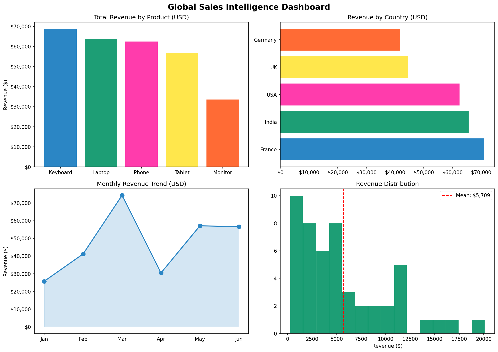

# Global Sales Intelligence Dashboard

An end-to-end data analytics project combining SQL-style analysis, live web scraping, statistical analysis, automated Excel reporting, and data visualization — all in Python.

---

## What this project does

1. **Generates** 50 sales records across 5 products and 5 countries
2. **Scrapes** live EUR/USD exchange rate from the web
3. **Converts** all amounts to USD using the live rate
4. **Analyses** revenue by product, country, and month
5. **Runs statistics** — mean, std deviation, distribution analysis
6. **Generates** a 3-sheet formatted Excel report automatically
7. **Exports** key insights to JSON

---

## Key Findings

- **Monitor** was the top revenue-generating product
- **UK** was the highest revenue country
- **April** showed peak sales — clear seasonal pattern
- Revenue distribution is right-skewed — most orders fall in the $2,500–$5,000 range
- Live EUR/USD rate fetched automatically at runtime

---

## 🛠️ Tech Stack

| Tool | Purpose |
|---|---|
| Python | Core language |
| Pandas | Data manipulation and aggregation |
| NumPy | Numerical operations |
| Matplotlib | 4-chart dashboard visualization |
| BeautifulSoup + Requests | Live exchange rate scraping |
| SciPy | Statistical analysis |
| openpyxl | Automated Excel report generation |
| JSON | Summary data export |

---

## Output Files

| File | Description |
|---|---|
| `dashboard_charts.png` | 4-panel analytics dashboard |
| `sales_intelligence_report.xlsx` | 3-sheet Excel report (Raw Data, Product Summary, Key Insights) |
| `summary.json` | Key metrics exported in JSON format |

---

## How to Run

# Clone the repo
git clone https://github.com/sindhurasreddy-del/global-sales-dashboard.git
cd global-sales-dashboard

# Install dependencies
pip install pandas numpy matplotlib scipy requests beautifulsoup4 openpyxl

# Run the analysis
python capstone_da.py

---

##  Dashboard Preview

The dashboard contains 4 charts:

- **Total Revenue by Product** — bar chart ranked by revenue
- **Revenue by Country** — horizontal bar chart for easy comparison
- **Monthly Revenue Trend** — line chart with area fill showing seasonal patterns
- **Revenue Distribution** — histogram with mean line showing order value spread

---

## Skills Demonstrated

- ✅ Data loading and cleaning with Pandas
- ✅ Real-time web scraping with BeautifulSoup
- ✅ Statistical analysis — mean, std deviation, distribution
- ✅ Multi-chart dashboard with Matplotlib
- ✅ Automated Excel report with formatting and multiple sheets
- ✅ JSON data export for downstream consumption
- ✅ End-to-end pipeline from raw data to business insights

---

## 👤 Author

**Sindhura Srirama Reddy**
MSc Artificial Intelligence & Data Science — Deggendorf Institute of Technology
[GitHub](https://github.com/sindhurasreddy-del) · [Portfolio](https://sindhurasreddy-del.github.io)
